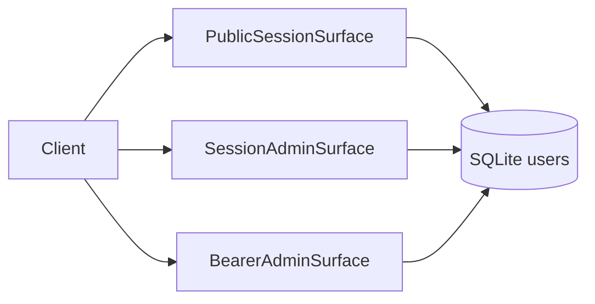

# Architecture — AES Auth Service

## Stack

- **Runtime:** Python 3.12 (Docker `python:3.12-slim`)
- **App:** single-module Flask app ([`app.py`](../../app.py))
- **Authn:** email/password → Werkzeug password hash → Flask session cookie (`user_id`)
- **Authz:** role string on `users.role` (`driver` | `pm` | `admin`)
- **Persistence:** SQLite file via `DATABASE_URL`
- **Deploy:** Dockerfile + gunicorn (`-w 2`) + Railway

## Layout

```
auth-service/
├── app.py                 # routes, DB, decorators
├── requirements.txt
├── Dockerfile
├── railway.json
├── README.md
├── .specify/              # binding Spec Kit + ontology
└── spec-kit/              # this human-readable layer
```

## Request surfaces



## Agent contract

Agents must follow [`.specify/spec.md`](../../.specify/spec.md) and [`.specify/memory/constitution.md`](../../.specify/memory/constitution.md). Domain changes require ontology updates and `validate_spec.py`.

## Production notes

- Session cookies: `HttpOnly`, `SameSite=Lax`, `Secure=True` (HTTPS required in prod).
- Multi-worker gunicorn without shared session store is sticky/fragile — Target: Redis or external session backend.
- SQLite on Railway is ephemeral unless volume-mounted — Target: managed Postgres if multi-instance.
